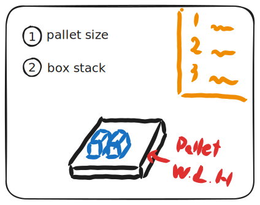

# box-stack-builder

An application for registering box positions to create stacks of boxes.

---

## UI design

## TODO

- [x] pallet size change script

    Test Scene: PalletSizeTest

    

- [x] container box spawn

    Test Scene: BoxSpawnTest

    

- [ ] container box fit position
- [x] container box move function

    Test Scene: AxisTest

    